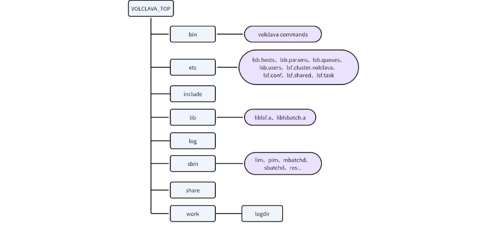
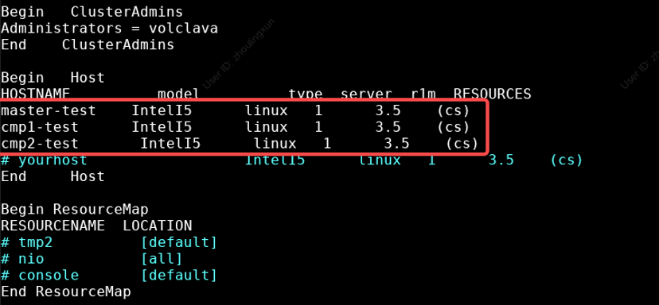

## Description
**volclava 1.0.0** is developed based on OpenLava 2.0 with following its license of GPL 2.0.

OpenLava is a free and open-source workload scheduler that's fully compatible with IBM LSF. It supports diverse high-performance computing and analytical applications.
It came from an early version of LSF through open-sourcing. Its command-line and file formats are similar to most LSF functions, so both users and administrators can easily get the hang of operating it.

**volclava** fixes obvious flaws and adds necessary features, covering the basic functional needs of the EDA business. It's recommended for use in small-scale clusters (with less than 100 nodes) where scheduling performance requirements aren't too high.

Everyone is welcomed to feed back via git issue.


## Support OS
- CentOS 6/CentOS 7/CentOS 8  
- Redhat/Rocky 8
- Ubuntu 20.04

The development and testing operating system for the volclava project 1.0.0 is CentOS Linux release 7.9.2009 (Core), which is also one of the commonly used operating system versions in IC design.
CentOS 6, CentOS 7, CentOS 8, as well as their corresponding Red Hat and Rocky versions should all be able to run. The main potential risk lies in that differences in system library versions may affect the operation of some components.

## Install
The following uses the example of setting up a cluster that has three nodes. Please confirm that all hosts in the volclava cluster can access the top-level installation directory of volclava using the same path name. For the convenience of management, it is recommended to move the software to the shared storage path

1. Download the code onto the master node
```
[user1@master-test install_pkg]# git clone https://github.com/bytedance/volclava.git
```
2. Log on master node as root, and enter the source code package directory
```
[root@master-test test]# cd /install_pkg/volclava
```
3. Run install script
```
[root@master-test volclava]# ./volcinstall.centos.sh --type=code --profix=/software/volclava-1.0
....
make[1]: Leaving directory `/install_pkg/volclava'
make: warning:  Clock skew detected.  Your build may be incomplete.
Congratulates, the volclava is installed under /software/volclava-1.0
You can source environment by: source /software/volclava-1.0/etc/volclava.sh 
Go on to configure master/compute node and enjoy journey!

```
4. Log on compute nodes and install
```
[root@cmp1-test ~]# source /software/volclava-1.0/etc/volclava.sh
[root@cmp1-test ~]# sh /software/volclava-1.0/etc/volclava.setup
[root@cmp2-test ~]# source /software/volclava-1.0/etc/volclava.sh
[root@cmp2-test ~]# sh /software/volclava-1.0/etc/volclava.setup
```

5. The directory of installed volclava



## Configure
1. Turn off the firewall on the hosts in cluster
```
[root@master-test ~]# systemctl stop firewalld
[root@master-test ~]# systemctl disable firewalld
Perform the same operations on other computing hosts.
```
2. If only the /etc/hosts file is used as the source of DNS resolution, it is necessary to add the mapping relationship between the IP addresses and hostnames of the machines within the cluster to the /etc/hosts file on each host.
```
[root@master-test ~]# cat /etc/hosts
127.0.0.1   localhost localhost.localdomain localhost4 localhost4.localdomain4
::1         localhost localhost.localdomain localhost6 localhost6.localdomain6
192.168.1.1 master-test
192.168.1.2 cmp1-test
192.168.1.3 cmp2-test
```
3. Edit the lsf.cluster.volclava file, add the hosts, and then save and exit.
```
[root@master-test-test etc]# vim /software/volclava-1.0/etc/lsf.cluster.volclava
```


## Quick started
1. Startup volclava cluster
```
[root@master-test ~]# yum install psmisc
[root@master-test ~]# service volclava restart
[root@cmp1-test ~]# yum install psmisc
[root@cmp1-test ~]# service volclava restart
[root@cmp2-test ~]# yum install psmisc
[root@cmp2-test ~]# service volclava restart
```
2. Verify the volclava cluster
```
[root@master-test ~]# service volclava status ##check daemons status
lim pid: <5922>
res pid: <5924>
sbatchd pid: <5927>
lim mbatchd: <5940>

[root@master-test ~]# lsid  ##check cluster status
volclava project 1.0.0, Nov 14 2024

My cluster name is volclava
My master name is master-test

[root@cmp2-test etc]# lshosts  ##check cluster static resources
HOST_NAME      type    model  cpuf ncpus maxmem maxswp server RESOURCES
master-test   linux  IntelI5 100.0     4 32012M 10239M    Yes (cs)
cmp1-test     linux  IntelI5 100.0     4 31993M 10239M    Yes (cs)
cmp2-test     linux  IntelI5 100.0     4 31993M 10239M    Yes (cs)

[root@cmp2-test etc]# lsload  ##check cluster load
HOST_NAME       status  r15s   r1m  r15m   ut    pg  ls    it   tmp   swp   mem
master-test         ok   0.0   0.0   0.1   0%   0.0   1     0 3321M   10G   28G
cmp1-test           ok   0.0   0.0   0.0   0%   0.0   1     6   20G   10G   29G
cmp2-test           ok   0.0   0.0   0.0   0%   0.0   1    24   45G   10G   30G

[root@cmp2-test etc]# bhosts  ##check workload on hosts
HOST_NAME          STATUS       JL/U    MAX  NJOBS    RUN  SSUSP  USUSP    RSV 
cmp1-test          ok              -      4      0      0      0      0      0
cmp2-test          ok              -      4      0      0      0      0      0
master-test        ok              -      4      0      0      0      0      0

```
3. Submit jobs to verify that the cluster is operating normally
```
[root@master-test ~]# su - volclava
[volclava@master-test ~]$ bsub sleep 100
Job <1> is submitted to default queue <normal>.
[volclava@master-test ~]$ bjobs 
JOBID   USER    STAT  QUEUE      FROM_HOST   EXEC_HOST   JOB_NAME   SUBMIT_TIME
1       volclav PEND  normal     master-test             sleep 100  Nov 27 15:03
```
Please refer to [Installation guide](docs/volclava%20%E5%AE%89%E8%A3%85%E5%8F%8A%E9%85%8D%E7%BD%AE%E6%96%87%E6%A1%A3.pdf) for more details on installation methods and configuration

## Documentation
The following article offers plentiful user and administrator operation guides, which can assist you in understanding and using the functions of volclava better.
- [User Guide](docs/volclava%20%E5%AE%89%E8%A3%85%E5%8F%8A%E9%85%8D%E7%BD%AE%E6%96%87%E6%A1%A3.pdf)
- [Administrator Guide](docs/volclava%20%E7%AE%A1%E7%90%86%E5%91%98%E6%89%8B%E5%86%8C.pdf)

&copy; Copyright (C) 2021-2024 ByteBance Ltd. and/or its affiliates